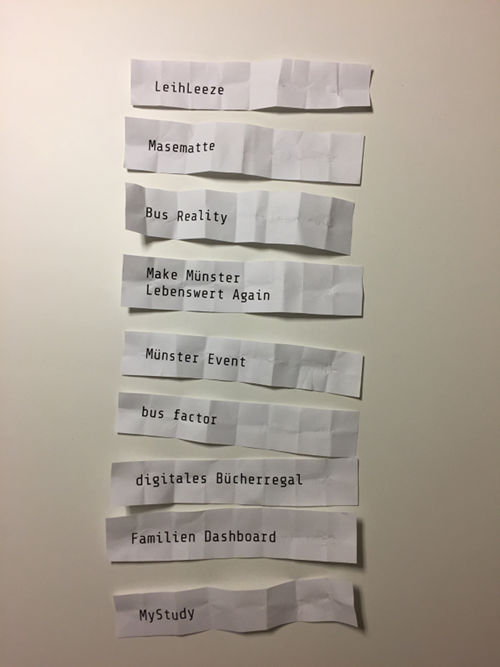

# Münsterhack 2017

## Web-Ressourcen

* News-Artikel: 
- Westfälische Nachrichten: https://www.wn.de/Muenster/3052078-Muensterhack-2017-Junge-IT-Entwickler-entwickeln-Ideen-und-Apps-fuer-Muenster
- Open.NRW Artikel: https://open.nrw/mshack17-hacken-fuer-eine-lebenswerte-stadt-muenster  
- Items-Homepage: https://www.itemsnet.de/digitalisierung/muensterhack-2017/
- Erwähnung des Münsterhack im Abschlussbericht zum Pilotprojekt Kommunales Open Government in  
NRW: https://open.nrw/sites/default/files/atoms/files/open.nrw_publikation_kommunales_open_government_in_nrw.pdf

* Offizielles Github-Repository: https://github.com/MSHACK17

# Die Projekte

## Bus Reality
- _Voraussagen von Busverspätungen jeder Linie und an jeder Haltestelle_
- **Code:** https://github.com/MSHACK17/bus-reality
- **Notizen:** Infos zum Nachtreffen bei den Stadtwerken: https://www.wn.de/Muenster/3090017-Muensterhack-Gewinner-stellen-ihr-Projekt-vor-Bus-Reality-Puenktlich-wie-der-Linienbus
- **Platzierung:** 1

## Leihleeze

- **Ergebnis:** https://www.leihleeze.de/
- **Code:**
  - Slack Channel zum Hackathon: muensterhack/#leeze
- **Platzierung:** 2

## Familien Dashboard

- **Ergebnis:** https://mein-ms.de/
- **Code:** https://github.com/codeformuenster/familien-dashboard
- **Platzierung:** 3

## Bus Factor

- **Code:** https://github.com/ThorbenJensen/predictive_traffic/tree/master/src/bus (ohne genauer spezifizierte Lizenz -> Copyright bei den Autoren des busfactor-Teams)
- **Notizen:** Die Daten für Busfactor (Anzahl Ein- und Ausstiege in Stadtwerke-Bussen) waren leider nur für den Münsterhack 2017 nutzbar und sind leider nicht öffentlich verfügbar.

## Make Münster Lebenswert Again

- **Code:** https://github.com/nsteffens/lebenswertMS

## Digitales Bücherregal

- **Code:** https://github.com/MSHACK17/localBookShop

## Masematte
- **Notizen:** keine Infos

## Münster Event
- **Notizen:** keine Infos

##  MyStudy
- **Notizen:** keine Infos

# Pitchreihenfolge:

