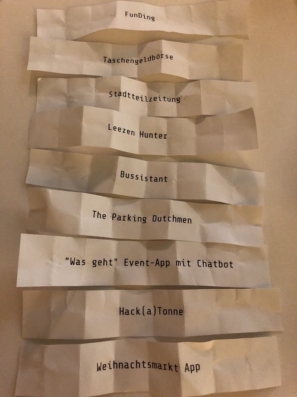

# Münsterhack 2018  
* WN-Artikel: https://www.wn.de/Muenster/3504992-Muensterhack-Sieger-geehrt-Gute-Ideen-im-Minutentakt
* Fotos: http://pressefotos.sputnik-agentur.de/album/96d03q (Nils Dietrich, Sputnik GmbH)

# Die Projekte

Pitchreihenfolge: 

Eine Liste aller Projekte, die beim Münserhack an den Start gingen: 

## Bussistant
* _Frustfreies Busfahren: Zuverlässige Abfahrzeit-Vorhersagen per Sprachassistent auf Basis von aktuellen Verkehrs- und Twitter-Daten_
* **Teammitglieder:** Anton, Johannes, Jonas, Manuel, [Rüdiger](https://github.com/JarnoRFB), Tillmann, Tino, Wolfram
* **Ressourcen:**
  * Sourcecode: https://github.com/JarnoRFB/bussistant
  * API Dokumentation: https://app.swaggerhub.com/apis-docs/conterra/swms-live/
  * Videos: https://www.youtube.com/watch?v=fki1opYZ-6o - https://www.youtube.com/watch?v=E33CjBH-hP8 - https://www.youtube.com/watch?v=Ex-USpiTamM
* **Ort:** items

## FunDing
* _Dat macht Fez - FUN-Ding! - Ideen, Förderer, Macher!_
* **Teammitglieder:** Benedikt, David, Dominik, Frank, [Helmut](https://twitter.com/hal1974), Marcel, Nicolas, Thomas (2x)
* **Ort:** items

## Hack(a)Tonne	
* _Aasee Sensorik / Monitoring für bessere Gewässeranalytik/-vorhersage_
* **Teammitglieder:** Andreas, Leonard, Magnus, [Michael](https://hansehack.de/#mentoren), Philipp, Siarhei
* **Beschreibung:** Der Sensorkersteller "Ott" stellt für den Münsterhack eine  „Hydrolab HL4 - Multiparametersonde“ mit entsprechendem LoRa Modul für die Datenübertragung zur Verfügung. Vom Waserschiffahrtsamt / Stadt Münster gibt es eine Genehmigung, die Messsonden im Abschnitt des Hafens/Kreativkai zu testen u. live zu demonstrieren (.ca. 100 m vom Veranstaltungsort des Hackathon entfernt u. 200 m vom LoRa Gateway).
* **Ressourcen:**
  * **Projekt-Url:** https://hackatonne.team-toe.de/
  * **Quellcode:** https://github.com/hack-a-tonne
  * **Api-Endpunkt:** https://hackertonne.azurewebsites.net/api/GetValuesByDevice?device_id=14	
  * **Slack-Channel:** https://muensterhack.slack.com/messages/CD2U7AZ4L
* **Ort:** FabLab	
* **Platzierung:** 1

## Leezen Hunter	
* _LeezenHunter - Wir finden deine Leeze!_
* **Teammitglieder:** Carsten, Johannes, Malte, Moritz, Robert, Sven
* **Ort:** FabLab	

## Stadtteilzeitung	
 * _Die Online- und Print-Zeitung von und für Bewohner und Bewohnerinnen der Stadtteile in Münster._
* **Teammitglieder:** Aashish, Ankit, Digdarshan, Thomas, Uwe		
* **Ort:** Digital Hub
* **Sourcecode:** https://github.com/codeformuenster/stadtteilzeitung

## Taschengeldbörse	
* _Der schnelle und effiziente Marktplatz zur einfachen Koordination und Vermittlung von helfenden Händen für Senioren_
* **Beschreibung:** Die Taschengeldbörse Münster ist ein Angebot für ältere und hilfsbedürftige Menschen in Münster. Jugendliche, im Alter von 15-18 Jahren unterstützen Hilfesuchende gegen ein kleines Taschengeld. Sie mähen den Rasen, helfen beim Aufhängen der Gardinen, kehren die Straße, gehen einkaufen, versorgen Haustiere oder beraten bei Handy- und Computerfragen. Es gibt eine große positive Resonanz, aber leider noch einen Schwachpunkt: Die Vermittlung der Aufgaben an die Jugendlichen läuft zu langsam. Wir wollen Abhilfe schaffen durch eine App. 
* **Teammitglieder:** Andreas, Bastian, Gregor, Jakob, Kemal, Lukas, Uta	
* __Ressourcen:__
  * Url: https://taschengeldboerse.io/
  * Quellcode: https://github.com/taschengeldboerse/muensterhack-web
    und https://github.com/taschengeldboerse/muensterhack-android
  * Slack-Channel: https://muensterhack.slack.com/messages/CD9E2DFGE/
  * Mutterprojekt: https://www.taschengeldboerse-muenster.de/
* **Ort:** items
* **Platzierung:** 3
  
## The Parking Dutchmen
* **Beschreibung:** Eine mobile App, die freie Parkplätze in Münster anhand der Vergangenheit vorhersagt und Verkehr smart steuert.
* **Teammitglieder:** Ataman, Jan, Olga, Raimund, Simon, Thorben		
* **Ort:** Digital Hub	
* **Platzierung:** 2

## "Was geht"
* *Event-App mit Chatbot*
* **Beschreibung:**	Eine Veranstaltungs-App mit einem Telegram-Chatbot, der auf Anfrage vorschläge in Gruppen macht, was unternommen werden kann.
* **Teammitglieder:** Allan, David, Florian, Jonas, Jonathan
* **Ort:** Digital Hub	

## Weihnachtsmarkt App
* 🎄❄⛄ Weihnachtsmarkt auf deinem Phone 🔔🎅🎁
* **Teammitglieder:** Christian, Felix, Gerald, Tobias, Yannic		
* **Ort:** Digital Hub	
* **Projekt-Url:** https://weihnachtsmarkt.ms	
* **Quellcode:** https://github.com/codeformuenster/weihnachtsmarkt
* **Notizen:** https://hackmd.okfn.de/s/HkPImrCYX#
