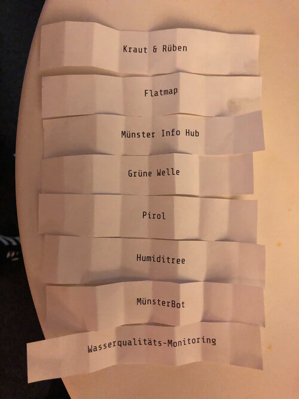

# Münsterhack 2019

# Die Projekte

Pitchreihenfolge:

## Kraut und Rüben

- _Eine App für den Wochenmarkt, um den Einkauf mit Karte und Suche zu erleichtern_
- Team: Moritz, Allan, Md Hasnain, Ann-Kathrin, Laura, Felix, Magnus
- Code: [https://github.com/Jabbbi/KrautUndRueben](https://github.com/Jabbbi/KrautUndRueben)

## Flatmap

- _Eine Heatmap zeigt user-individuelle Orte in Münster an, die den jeweiligen Wohn-Vorlieben entsprechen._
- Team: Gerrit, [Vincent](https://github.com/Vnnncnnnt), [Mark](https://github.com/crazzle), Joseph, Johanna, [Tim](https://github.com/tsabsch), Marcus, Philipp
- Code: [https://github.com/crazzle/mshack19_frontend/](https://github.com/crazzle/mshack19_frontend/), [https://github.com/crazzle/mshack19_backend/](https://github.com/crazzle/mshack19_backend/)
- Platzierung: 3

## Münster Info Hub

- _Topaktuelle Veranstaltungsinformationen, maßgeschneidert für Besucher und Ortsansässige_
- Team: [Julian](https://github.com/julianbei), [Thomas](https://github.com/toms_rocket), [Tobias](https://github.com/webwurst), [Yannic](https://github.com/jahnique), [Martin](https://github.com/quassy), [Jonas](https://github.com/jonahoen), [Nicholas](https://github.com/rappertomate), [Jona](https://github.com/JonesH), [Gerald](https://github.com/ubergesundheit)
- Code: [https://github.com/codeformuenster/muenster-info-hub](https://github.com/codeformuenster/muenster-info-hub)
- Ergebnis: [app.muenster.jetzt](https://app.muenster.jetzt), [muenster.jetzt](https://muenster.jetzt)
- Platzierung: 2, Mentorenpreis

## Grüne Welle

- _Grüne Welle für die Leeze – Schneller und sicherer durch Münster mit Visualisierung und Vorhersage von Ampelphasen._
- Team: [Bastian](https://github.com/kannix), Simeon, Nina, [Thorben](https://github.com/thorbenjensen), [Ronja](https://github.com/Ronjakoehling), [Christian](https://github.com/thunfischtoast), [Katja](https://github.com/katjaschu), [Jens](https://github.com/Effizjens), [Thomas](https://github.com/silberzwiebel), [Yousef](https://github.com/YouQam)
- Code: [https://github.com/Green-Wave](https://github.com/Green-Wave)
- Platzierung: Publikumspreis 1. Platz (26%)

## Pirol

- _Eine  Kombination aus Mobile-App und Webapp verbindet und unterstützt Bürger, Behörden und Unternehmen bei der gemeinsammen Bekämpfung der Eichenprozessionsspinner_
- Team: Marcel, Marie, Anton, Kristin, Paul, Binh, Sarah, Sebastian
- Ergebnis: [https://pirol.citysaver.org/](https://pirol.citysaver.org/)

## Humiditree

- _Eine Gieß-Community für Münster's Stadtbäume, um ein gutes städtisches Klima zu bewahren._
- Team: Frederick, [Tamara](https://github.com/TamaraGunkel), Malte, [Jörg](https://github.com/jay-15), [Lennart](https://github.com/len-n-a-rt), [Lennart](https://github.com/lennartseeger), Annie, Hubertus, Kevin
- Platzierung: Publikumspreis 2. Platz (16%)

## MünsterBot

- _Ein Bot der dir in Messager alles rund um Münster sagen kann Proaktiv oder auf Nachfrage. Dazu gibt es von Nutzern erstellte Beiträge um generelle Informationen zu ergänzen._
- Team: Muhammed, Julian, Manuel, [Simon](https://github.com/simonherbert), Erik
- Code: [https://github.com/simonherbert/muensterbot](https://github.com/simonherbert/muensterbot)
- Platzierung: 1, Publikumspreis 3. Platz (15%)

## Wasserqualitäts-Monitoring

- _Messstationen zur Überwachung der Wasserqualität entlang eines Gewässers zur Lokalisierung von eingeleiteten Verschmutzungen._
- Team: Florian, Patrick, [Tom](https://github.com/ScholliYT), Christopher
- Code: [https://github.com/ScholliYT/mshack-wateranalysis](https://github.com/ScholliYT/mshack-wateranalysis)
