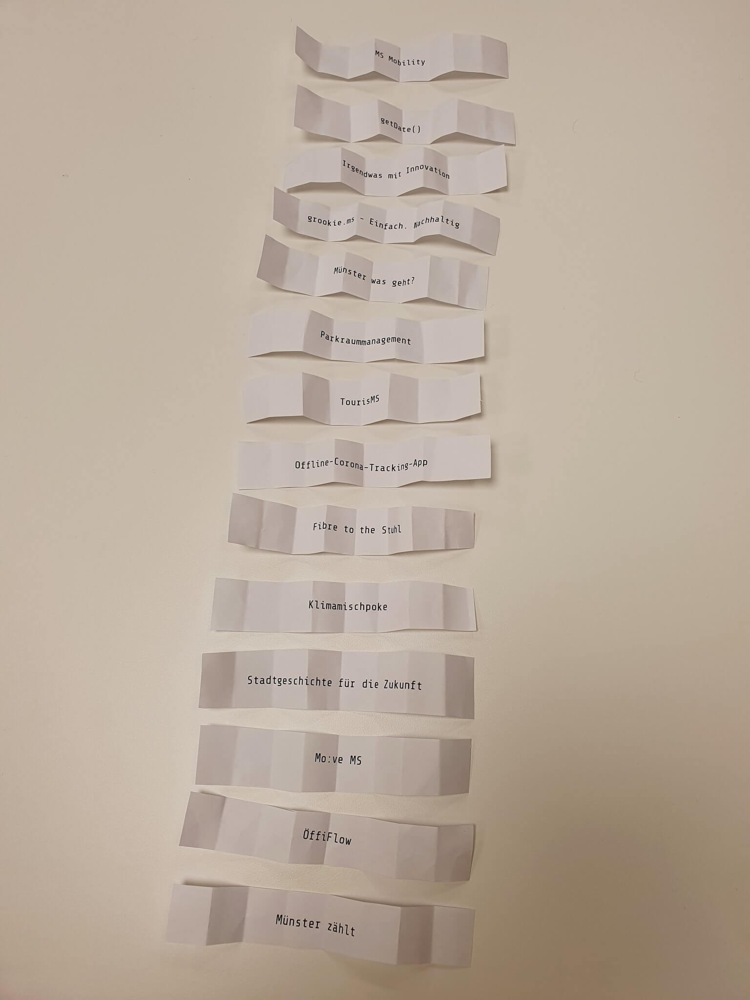

# Münsterhack 2020

- WN-Artikel: [https://www.wn.de/Muenster/4281703-Tech-Szene-trifft-sich-zum-4.-Muensterhack-Muenster-sucht-die-Supernerds](https://www.wn.de/Muenster/4281703-Tech-Szene-trifft-sich-zum-4.-Muensterhack-Muenster-sucht-die-Supernerds)
- Video Abschlusspitches [https://www.youtube.com/watch?v=iTgOYSXQ9Gk](https://www.youtube.com/watch?v=iTgOYSXQ9Gk)
- Nachgeha(c)kt Preis 2020: [Grüne Welle](https://github.com/codeformuenster/muensterhack/blob/master/2019.md#gr%C3%BCne-welle)

# Die Projekte

Pitchreihenfolge:

## TourisMS

- _Stadtführungen neu gedacht - wir verweben das Digitale mit dem Analogen, um eine neue Erfahrung für alte Sehenswürdigkeiten zu bieten_
- **Team:** [Felix](https://gitlab.com/Felix-Ulonska), [Larissa](https://gitlab.com/larissa_ma), [Leonard](https://gitlab.com/TheDoctor), [Moritz](https://gitlab.com/dead_hamster), Nora, [Tim](https://gitlab.com/parazera), [Tom](https://tomstein.me/)
- **Code:** https://gitlab.com/tourisms/tourismsapp
- **Ergebnis:** Android App (siehe GitLab)
- **Platzierung:**: 3

## Stadtgeschichte für die Zukunft

- _50 Jahre Schülerforschung in Münster? Digitalize it!_
- **Team:**: Richard, Philipp, Johanna, Lennart, Lennart, Tim
- **Platzierung:**: Mentorenpreis

## MS Mobility

- _Eine App für smarte Mobilität in Münster_
- **Team:**: Justin, Frank, Moritz, Mehmet

## KlimaHeroes

- _Jeder einzelne von uns kann durch sein Handeln dazu beitragen, unser Klima zu schützen. Mit KlimaHeroes motivierst Du Dich und Deine Freunde spielerisch, im Alltag einen nachhaltigeren Lebensstil zu führen. Mit klimarelevanten Echtzeitdaten aus ganz Münster siehst Du direkt, wo wir gemeinsam stehen. Denn nur gemeinsam sind wir stark!_
- **Team:** Majd, Yona, Dominik, Kevin, Ronja, Caroline, Sven, Sina, Katja, Niklas, Thomas, Frederik, Marc Lennard, Quynh-Ngan
- **Code:** https://github.com/MarcLennard/Klimamischpoke
- **Weiterentwicklung:** https://linktr.ee/KlimaHeroes
- **Platzierung:** 1

## TerminMS

- _Coronafrisur, Coronatest, Coronasoforthilfe – für alles braucht man Termine: TerminMS – Terminvereinbarung direkt und intuitiv auf einer Plattform - Winwin für Kunden und Dienstleister, vom Friseur über den Arzt bis hin zur Behörde._
- **Team:**: Paul, Felix, Steffen, Freya, Felix
- **Platzierung:**: 2

## Parkraummanagement

- _Auf der Suche nach einem freien Parkplatz? Genervt von Falschparkern und Pseudo-Elektroautos? Mit Münster:parkme wird die Parkplatzsuche smart._
- **Team:**: Anastasia, Moritz, Rieke, Michael, Markus, Peer, Marc, Mario, Kolja, Paula Roberta, Holger, Michael, Erik

## grookie.ms - Einfach. Nachhaltig

- _Wir ermöglichen einen leichten Einstieg in einen nachhaltigen Lifestyle für Münsteraner:innen._
- **Team:**: Dieter, Vincent, Michel, Anna, Mark, Johanna, Lukas, Philip, Waldemar, Lena, Lisa

## Münster zählt

- _Crowd Counting Plattform zur IoT-basierten und anonymisierten Personenzählung_
- **Team:**: Eugen, [Bastian](https://github.com/bcyberbasti), Janek, [Tobias](https://github.com/webwurst), [Simeon](https://github.com/simsal0r), [Oskar](https://github.com/ohlr), [Thorben](https://github.com/thorbenjensen), [Johannes](https://github.com/jkellers), [Gerald](https://github.com/ubergesundheit), [Martin](https://github.com/quassy), [Christian](https://github.com/thunfischtoast), Hendrik
- **Code**:
  - https://github.com/codeformuenster/mshack2020-frontend
  - https://github.com/codeformuenster/mshack2020-counting-mobileapp
  - https://github.com/codeformuenster/mshack2020-counting-backend
  - https://github.com/codeformuenster/mshack2020-hardware
  - https://github.com/codeformuenster/mshack2020-counting-dart-openapi
  - https://github.com/codeformuenster/traffic-cam
  - https://github.com/codeformuenster/traffic-cam-data

## Fibre to the Stuhl

- _Infektionsketten sind für Gesundheitsämter aufwändig zu verfolgen. Anrufe, E-Mails und Briefe. Viele verschiedene Kanäle und kein zentraler Überblick. Wir machen Schluss damit!_
- **Team:**: Jan, Tim, Rudolf, Dennis, Sven

## Münster was geht?

- _Verlieb Dich neu in Deine Stadt - Finde Orte und Events, die wirklich zu Dir passen!_
- **Team:**: Laura, Tim, Thomas
- **Code:** https://github.com/codeformuenster/muenster-was-geht
- **Platzierung:**: Zuschauerpreis

## Irgendwas mit Innovation

- _Innovation von Münster für Münster_
- **Team:**: Jan, Dominik, Simon, Christian, Chiara, Julian, Robert

## Mo:ve MS

- _Mo:ve MS - Das Mobilitätsversprechen für Münster ist eine ÖPNV-Ticketapp in der gegen ein 20ct upgrade zum normalen Bus-Ticket Verspätungen automatisch erkannt und dann kostenlos in eine Tier-Scooter fahrt umgewandelt werden._
- **Team:**: Linus, Rafael, Tim, René, Rosario

## ÖffiFlow

- _Wo hakt’s? Der Bus der sagt’s!_
- **Team:**: Lukas, Andre, Jan, Carsten
