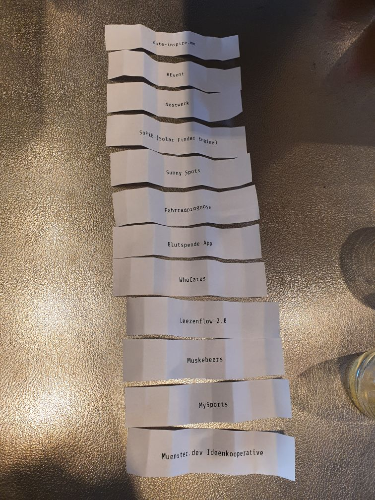

# Münsterhack 2021

- WN-Artikel: ?
- Video Abschlusspitches: ?

# Die Projekte

Pitchreihenfolge:

## data-inspire.me

## REvent
Flutter: [github.com/Just-another-Muensterhack/revent](https://github.com/Just-another-Muensterhack/revent)  
Google Cloud functions: [github.com/Just-another-Muensterhack/revent-cloud](https://github.com/Just-another-Muensterhack/revent-cloud)  
Assets: [github.com/Just-another-Muensterhack/revent-assets](https://github.com/Just-another-Muensterhack/revent-assets)  
Demo: [web.reventapp.de/](https://web.reventapp.de/)  

## Nestwerk
Die Familien-App: https://github.com/morschl/familienapp

## SoFIE (Solar Finder Engine)

## Sunny Spots

## Fahrradprognose

## Blutspende App

## WhoCares

## Leezenflow 2.0

## Muskebeers

## MySports

## Münster.Dev Ideenkooperative
