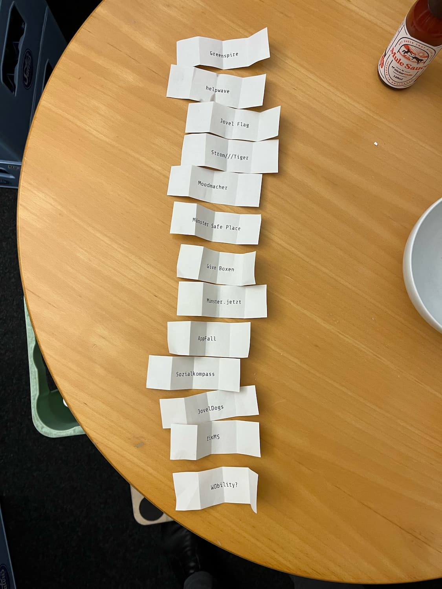

# Münsterhack 2022

- Nachgeha(c)kt Preis 2022: Blutspende

# Die Projekte

## AppFall

- _AppFall hört nicht bei der richtigen Tonne auf - Unser intelligenter Begleiter für ressourcenschonenden Konsum macht ganz Münster zum Wertstoffhof._
- **Team:** Anni, Bennet, Carlo, Daniel, Drazen, Eike, Feko, Manoel, Tim-Luca
- **Code:**
  - [Frontend/App](https://github.com/eikaramba/appfall-frontend)
  - [Backend](https://github.com/lagmoellertim/appfall-backend)
  - [Docker](https://github.com/lagmoellertim/appfall-db)
- **Platzierung:** 3

## fixMS

- _fixMS bietet userfreundlichere Interfaces für das Mängelmeldeformular der Stadt Münster, was deren Behebung vereinfacht und somit die Lebensqualität steigert.fixMS bietet userfreundlichere Interfaces für das [Mängelmeldeformular der Stadt Münster](https://www.stadt-muenster.de/maengelmeldung), was deren Behebung vereinfacht und somit die Lebensqualität steigert._
- **Team:** Alexander, Christoph, Christoph, Felix, Jens, Julius, Katharina, Leonard, Mansoor, Nora, Robert
- - **Code:**
  - [wearable](https://github.com/Fix-MS/wearable)
  - [Frontend/App](https://github.com/Fix-MS/app)
  - [bikebutton](https://github.com/Fix-MS/bikebutton)
  - [Backend](https://github.com/Fix-MS/backend)
- **Platzierung:** 1

## Give Boxen

- _Münster’s Givebox-Network – Wir eröffnen für Giveboxen in Münster eine digitale Community und schaffen einfachen digitalen Zugang zu Infos, Events und Austausch mit Nutzern und Paten._
- **Team:** Alexander, Bodo, Christian, Fardad, Lennart, Leroy, Leschek, Martin, Matthias, Rainer, Vadim
- **Code:** https://github.com/Informationsfabrik/give_box_ms_hack
- **Ergebnis:** [Demo](https://givebox-ms.de)

## Greenspire

- _Greenspire ist eine App, die Benutzer inspiriert, nachhaltige (Inter-)Aktionen mit unserer Stadt Münster in den Alltag zu integrieren._
- **Team:** Alexander, Andi, Carlo, Florian, Jana, Julius, Lucas, Maurice, Niklas, Onno, Steffen

## helpwave

- _helpwave hilft dabei Ersthelfer:innen in unmittelbarer Nähe zu Notfallorten zu mobilisieren, um eine erste Versorgung noch vor dem Eintreffen des RTWs gewährleisten zu können._
- **Team:** Christian, Felix, Felix, Florian, Friedjof, Jan-Eric, Jannik, Jonas, Max, Max, Nico, Sebastian, Tassilo
- **Code:**
  - [Backend](https://github.com/Just-another-Muensterhack/helpwave-backend.git)
  - [Frontend/App](https://github.com/Just-another-Muensterhack/helpwave-backend.git)
  - [Static/Content](https://github.com/Just-another-Muensterhack/helpwave-static.git)
- **Ergebnis:** [Demo](https://helpwave.de)
- **Platzierung:** Zuschauerpreis

## Jovel Flag

- _Jovel Flag ist eine App mit der ihr virtuelle Flaggen in ganz Münster sammeln könnt und die euch dazu animieren von euch noch unentdeckte Orte zu erkunden._
- **Team:** Joschka, Julian, Lennard, Maid, Marc, Paul, Steffen
- **Code:** [Jovel Flag](https://github.com/JovelFlag/JovelFlag)

## JovelDogs

- _JovelDogs - Wir lieben Hunde, aber auch eine saubere Stadt._
- **Team:** Johannes, Johannes, Lukas, Lukas, Marius, Miguel

## Moodmacher

- _Wir möchten in der dunklen Jahreszeit die Stimmung der MünsteranerInnen durch motivierende Texte und Botschaften aufhellen._
- **Team:** Andrey, Arne, Eyk, Houssem Eddine, Ivan, Jonas, Philip, Shawn

## Münster Safe Place

- _Wie ein Leuchtfeuer begleitet Safespace die Menschen sicher auf ihrem Heimweg. Safespace zeigt Orte, die Nachts gemieden werden sollten und stellt sichere Häfen in Echtzeit auf der Karte dar. Das kann der nächste Stadtbus sein, ein Kiosk der noch geöffnet ist, oder einfach eine hell erleuchtete Tankstelle._
- **Team:** Alexander, Jan, Kai, Krystof, Marvin

## Münster.jetzt

- _We’re leveraging 3D visualization of Open Data to support multiple use cases for tourism, city planning and citizens._
- **Team:** Gerald, Palaniappan, Rahul, Subhashini, Thomas, Thorben, Tobias, Tobias
- **Code:** [https://github.com/codeformuenster/muenster-jetzt](https://github.com/codeformuenster/muenster-jetzt)

## Sozialkompass

- _Das Formular sollte dich finden und nicht du das Formular: Der Sozialkompass navigiert dich multilingual und barrierefrei durch Münsters Antrag-Albtraum!_
- **Team:** Cedric, Hendrik, Jonas, Julian, Julian, Lennart, Ole, Sören Mathis, Steffen, Sven
- **Platzierung:** 2, Mentoren

## Strom///Tiger

- _Wir verringern den Strompreisanstieg für Endverbraucher durch genauere Stromlastprognosen bei Energieversorgern, indem wir zusätzliche Einkaufskosten senken._
- **Team:** Cedric, Hendrik, Jonas, Julian, Julian, Lennart, Ole, Sören Mathis, Steffen, Sven

## WObility?

- _Mit WObility lassen sich auf einen Blick die attraktivsten Standorte für öffentliche Ladeinfrastruktur auf gewerblichen Flächen identifizieren – für eine lückenloses Ladenetz in Münster!_
- **Team:** Alexander, Bastian, David, Jonas, Lars, Lukas, Moritz

## Ein Projekt

- _Ein Projekt ist ein Projekt mit einer Beschreibung die das Projekt in einem Satz beschreibt._
- **Team:** [xxxx](xxxx)
- **Code:** [xxxx](xxxx)
- **Ergebnis:** [xxx](xxx)
- **Notizen:**: xxx
- **Platzierung:**: xxx
- **Updates:**: xxx

# Pitchreihenfolge:

