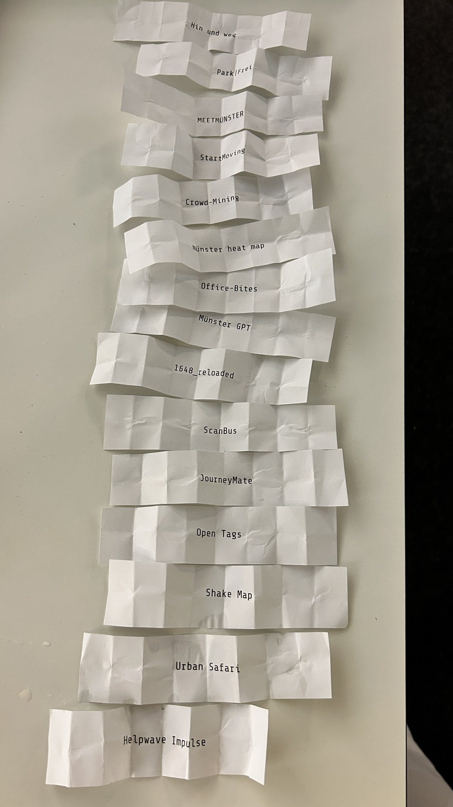

# Münsterhack 2023

- Nachgeha(c)kt Preis 2023: Sozialkompass

# Die Projekte

## HinUndWeg

- _Dein Umzug in Münster kann mehr als nur ein Wohnortwechsel sein: Mit HinUndWeg wird dein Umzug zu einer Gelegenheit, überflüssige Gegenstände einfach zu spenden, reparieren zu lassen oder korrekt zu entsorgen._
- **Team:** 
- **Code:**
  - 

## Park|Frei

- _Wir sensibilisieren die Münsteraner:innen für das Thema Mobilitätswende, indem wir die Vorteile autoreduzierter Wohnquartiere aufzeigen, alternative Verkehrsmittel zum Auto stärken und Interessensgruppen miteinander vernetzen und mobilisieren._
- **Team:** 
- **Code:**
  - 

## MEETMÜNSTER

- _Wir wollen deine Stadt für dich erlebbar machen. Mithilfe von KI-generierten Stadtführungen, zugeschnitten auf deine Interesssen, entdeckst du Münster auf deine persönliche Art und Weise._
- **Team:** 
- **Code:**
  - 
- **Platzierung:** 1

## StartMoving

- _Wir stoppen das Vereinssterben, indem wir Sportbegeisterte und Vereine vernetzen und ein zugängliches Angebot für Interessierte bereitstellen._
- **Team:** 
- **Code:**
  - 
- **Platzierung:** 3

## Crow-Mining

- _Wir wollen die Polizei und Menschen in Münster über aktuelle und zukünftige Menschenansammlungen frühzeitig informieren und hierzu OpenData zur Ermittlung nutzen._
- **Team:** 
- **Code:**
  - 

## münsterHeatMap

- _Wir informieren Münsteraner:innen und zeigen mit Hilfe von KI und OpenData die zukünftige Wärmeversorgung sowie Alternativen auf._
- **Team:** 
- **Code:**
  - 

## Office-Bites

- _Wir erstellen eine Plattform für Foodtrucks, mit der Nutzer:innen deren aktuellen Standort verfolgen können und so die Pause zu Erholung werden lassen und nicht zur Wartezeit._
- **Team:** 
- **Code:**
  - 

## MünsterGPT

- _Wir haben einen Chat-Assistenten für die Bürgerinnen und Bürger der Stadt Münster entwickelt, der ihnen dabei hilft, Fragen rundum den Bürgerservice schneller zu beantworten._
- **Team:** 
- **Code:**
  - 
- **Platzierung:** 2

## 1648_reloaded

- _Wir nutzen den stillliegenden Publikumsmagneten “Spieltisch zum Westfälischen Frieden” des LWL Museums für Kunst und Kultur und machen dessen Hard- und Software zu einer erweiterbaren OpenSource Platform, der sich auch andere Museen oder öffentliche/gemeinnützige Einrichtungen bedienen können._
- **Team:** 
- **Code:**
  - 

## ScanBus

- _Wir machen den Weg frei für Busse in Münster. Durch das intelligente Sammeln von Daten beseitigen wir Hindernisse auf Busspuren und helfen der Stadt bei der Städteplanung._
- **Team:** 
- **Code:**
  - 

## JourneyMate

- _JourneyMate, dein virtueller Assistent, der dir dabei hilft, dich mit gesundheitlichen Tipps fit zu halten und gleichzeitig die Stadt Münster zu erkunden._
- **Team:** 
- **Code:**
  - 

## Open Tags

- _OpenTags sind quelloffene, preiswerte IoT-Trackinggeräte, welche Privatsphäre garantieren und höchste Sicherheits- und Datenschutzanforderungen erfüllen, um Gegenstände in Echtzeit zu verfolgen._
- **Team:** 
- **Code:**
  - 
- **Platzierung:** 1/2 Mentor:innenpreis

## Shake Map

- _Wir entwickeln eine kostengünstige Sensorplattform zur kontinuierlichen automatischen Bewertung von Radwegen._
- **Team:** 
- **Code:**
  - 
- **Platzierung:** Publikumspreis und 1/2 Mentor:innenpreis

## Urban Safari

- _Wir motivieren Bürger:innen zur Entdeckung von Münsters Insektenwelt mittels einer KI-basierten Fotoanalyse. Zu jedem Tier erhält der Nutzende Informationen und kann Abzeichen sammeln._
- **Team:** 
- **Code:**
  - 

## helpwave Impulse

- _Wir helfen Münsteraner:innen, zusammen mit und in ihrer direkten Umgebung gesünder zu leben und spielerisch gesundheitlichen Problemen vorzubeugen._
- **Team:** 
- **Code:**
  - 

## Ein Projekt

- _Ein Projekt ist ein Projekt mit einer Beschreibung die das Projekt in einem Satz beschreibt._
- **Team:** [xxxx](xxxx)
- **Code:** [xxxx](xxxx)
- **Ergebnis:** [xxx](xxx)
- **Notizen:**: xxx
- **Platzierung:**: xxx
- **Updates:**: xxx

# Pitchreihenfolge:

