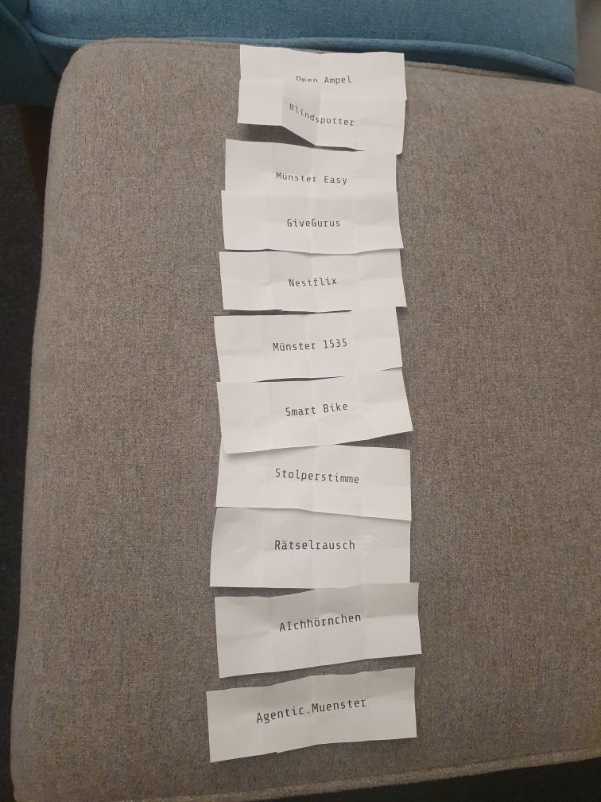

# Münsterhack 2025

- Nachgeha(c)kt Preis 2025: [helpwave](https://helpwave.de/)

# Die Projekte

## AIchhörnchen

- _AIchhörnchen macht Fundmeldungen kinderleicht – drei Klicks: Foto, Ort, Kontakt, fertig – und KI hilft, Verlorenes zu indexieren und schnell wiederzufinden.
[- von verlorenen Leezen bis zu vergessenen Jacken in der Bar.]_
- **Team:** Felix, Felix, Friedjof, Julia, Leticia, Moritz, Paul, Sophia, Anni
- **Code:** 
  - **Backend**: [AIchhörnchen-Backend](https://github.com/Just-another-Muensterhack/aichhoernchen-backend)
  - **Frontend**: [AIchhörnchen-Frontend](https://github.com/Just-another-Muensterhack/aichhoernchen-frontend)
  - **Utils**: [AIchhörnchen-Utils](https://github.com/Just-another-Muensterhack/aichhoernchen-utils)
- **Ergebnis:** [AIchhörnchen](https://aichhoernchen.de)
- **Platzierung:**: 1. Platz

## Agentic.Muenster

- _Durch Agentic.Münster können Münsteraner:innen per (Voice-)Chat Termine beim Bürgerservice buchen und alle für den Termin notwendigen Unterlagen werden dabei gleich auch noch vorbereitet._
- **Team:** Gerrit, Helene, Hendrik, Jonas, Mathis, Nils, Sebastian, Tobias
- **Platzierung:**: 2. Platz

## Blindspotter

- _Blindspotter ist ein Tool, mit dem Planer lokale Planungsentscheidungen aus der Perspektive der Menschen betrachten können, die in dem betroffenen Gebiet leben._
- **Team:** Andi, Anna-Lena, Jan, Lucas, Pauline, Vitali, Vivian

## GiveGurus

- _Wir machen Münsters Sharing Infrastruktur Digital sichtbar und leichter zugänglich für jeden._
- **Team:** Antonio, Claude, Friedrich, Gina, Kerstin, Leonhard, Thomas, Tim

## Münster 1535

- _Münster 1535 mittendrin - wir wollen Münsters Geschichte erlebbar machen - interaktiv und mit moderner Virtual Reality Technologie._
- **Team:** Frank, Jonathan, Philipp, Tristan

## Münster Easy

- _Wir erstellen eine Karte mit Baustellen und anderen Hindernissen, perspektivisch auch ein Routing für barrierefreie Mobilität._
- **Team:** Alicia Kristina, Bandik, Carolin, Franziska, Frederik, Jana, Johannes, Joscha, Lisa, Renja, Robert, Sarah, Tim
- **Platzierung:**: Zuschauerpreis

## Nestflix

- _Wir machen Naturschutz erlebbar durch DIY-Smart-Nistkästen mit Live-Streaming und Citizen Science für alle._
- **Team:** Christopher, Cuma, Daniel, David, Nic, Sarosh

## Open Ampel

- _Wir haben Lezenflow weiterentwickelt: Mit unserer App können FahrradfahrerInnen Informationen erhalten, wann die nächste Ampel auf schaltet und ob es sich noch lohnt Gas zu geben._
- **Team:** Felix, Jonas, Kilian, Lars, Lennart, Leonard, Leonie, Marie-Christine, Steffen, Thomas

## Rätselrausch

- _Rätselrausch ist die Quiz-App für Münsters Kneipenkultur: gesellig, clever, mit echten Prämien für deine Erfolge._
- **Team:** Christian, Felix, Florian, Jens, Jule, Lara, Leon, Roman, Selina

## Smart Bike

- _Wir rüsten Fahrräder mit intelligenten Fahrassistenten aus, um Verkehrssicherheit und Komfort im Alltag zu verbessern._
- **Team:** Christian, Jakob, Nils, Robin, Sonja

## Ein Projekt

- _Ein Projekt ist ein Projekt mit einer Beschreibung, die das Projekt in einem Satz beschreibt._
- **Team:** [xxxx](xxxx)
- **Code:** [xxxx](xxxx)
- **Ergebnis:** [xxx](xxx)
- **Notizen:**: xxx
- **Platzierung:**: xxx
- **Updates:**: Platz und Mentor:innenpreis

# Pitchreihenfolge:

