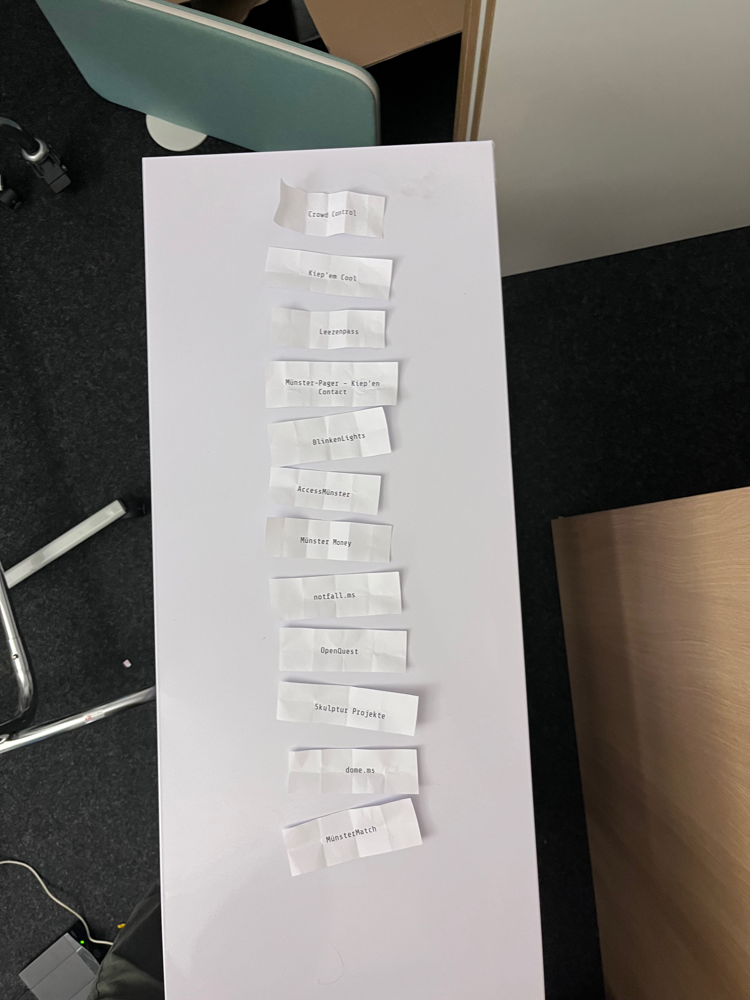

# Münsterhack 2026

- Nachgeha(c)kt Preis 2026:

# Die Projekte

## AccessMünster

- Barrierefreie Routenplanung für Münster: rollstuhlgerechte, schattige Wege ohne Hitze/Hindernisse. Künftig mit Nutzerverwaltung & weiteren Barrierefreiheits-Angeboten.
- **Team:** Anuschka, Joel, Judith, Karin, Lena, Mahboubeh, Markus, Paula, Peter, Stefan
- **Code:** [xxxx](xxxx)
- **Ergebnis:** [xxx](xxx)
- **Notizen:**: Raum: items - Nashorn - 2. OG rechts
- **Platzierung:**: xxx
- **Updates:**: xxx

## BlinkenLights

- 	Der Gamefloor bringt mehr Spaß nach Münster! Durch interaktive Stadtkunstwerke sollen Menschen auf spielerische Art zusammengebracht werden.
- **Team:** Alexander, Frederik, Jonas, Joshua, Marie-Christine, Martin, Matteo, Naemi, Pascal
- **Code:** [xxxx](xxxx)
- **Ergebnis:** [xxx](xxx)
- **Notizen:**: Raum: items - Elefant 1 - 1. OG rechts
- **Platzierung:**: xxx
- **Updates:**: xxx

## Crowd Control

- 	Wir visualisieren Besuchermengen auf größeren Events, z.b. Messen oder Volksfeste.
- **Team:** Emily, Tim, Tino
- **Code:** [xxxx](xxxx)
- **Ergebnis:** [xxx](xxx)
- **Notizen:**: Raum: items - Gorilla - 2. OG links
- **Platzierung:**: xxx
- **Updates:**: xxx

## ms.dome

- _Keine Beschreibung angegeben._
- **Team:** Birkan, Felix, Felix, Florian, Moritz, Paul, Sophia
- **Code:** [xxxx](xxxx)
- **Ergebnis:** [xxx](xxx)
- **Notizen:**: Raum: Hub - Forum - EG - links
- **Platzierung:**: xxx
- **Updates:**: xxx

## Kiep'em Cool

- Kiep'em Cool gibt bei starker Hitze einfach persönliche Empfehlungen: Aus Münsters offenen Daten, Standort und Live-Wetter erfahren vor allem vulnerable Menschen, was ihnen jetzt hilft.
- **Team:** Anusan, Björn, Cuma, Hendrik, Jana, Jonas, Max, Nic, Steffen
- **Code:** [xxxx](xxxx)
- **Ergebnis:** [xxx](xxx)
- **Notizen:**: Raum: items - Ameisenbär - 2. OG links
- **Platzierung:**: xxx
- **Updates:**: xxx

## Leezenpass

- 	We want to strengthen solidarity and mental health. For that, we offer an application that proposes good dees. For example, to find stolen bikes. Beneath that, we connect people digital and analogue.
- **Team:** Adarsh, Frank, Niharika, Philipp, Viola
- **Code:** [xxxx](xxxx)
- **Ergebnis:** [xxx](xxx)
- **Notizen:**: Raum: items - Elefant 2 - 1. OG rechts
- **Platzierung:**: xxx
- **Updates:**: xxx

## Münster Money

- 	Münster hat einen Plan. Wir machen ihn lesbar: Münster Money verwandelt den Haushalt 2026/27 in interaktive Diagramme. Entdecke, wohin das Geld fließt – ganz ohne Kämmerei-Diplom.
- **Team:** Annabell, Christian, Elina, Johann, Robin, Thomas, Thomas, Tobias
- **Code:** [Repo](https://github.com/codeformuenster/haushalt-muenster-2026)
- **Ergebnis:** [Online](https://codeformuenster.org/haushalt-muenster-2026)
- **Notizen:**: Raum: Hub - Accelerator - EG rechts
- **Platzierung:**: xxx
- **Updates:**: xxx

## Münster-Pager - Kiep'en Contact

- Münsterpager ist dein persönlicher Kiepenkerl: Er hält Familien, Nachbarn und Gruppen in Münster erreichbar, ganz ohne Handynetz, und zeigt per GPS, wo jemand ist, wenn es darauf ankommt.
- **Team:** Eike, Georg, Luke, Marc, Rebekka, Thorben, Vadim
- **Code:** [xxxx](xxxx)
- **Ergebnis:** [xxx](xxx)
- **Notizen:**: Raum: Hub - Makerspace - 2. OG - links
- **Platzierung:**: xxx
- **Updates:**: xxx

## MünsterMatch

- 	Zeit ist wertvoll und Recherche nach Aktivitäten kostet viel Zeit und man entdeckt viele tolle Aktivitäten potentiell nicht. Unser USP ist, dass wir dem Nutzer auf Basis von Präferenzen Aktivitäten mi
- **Team:** Damian-Luke, Ina, Jonas, Jonathan, Martin, Maximilian, Timo
- **Code:** [xxxx](xxxx)
- **Ergebnis:** [xxx](xxx)
- **Notizen:**: Raum: items - Tiger - 2.OG rechts
- **Platzierung:**: xxx
- **Updates:**: xxx

## notfall.ms

- notfall.ms bietet Münsteraner offlinefähige Lösungen, um im Krisenfall wichtige Informationen verfügbar zu halten und auch bei Ausfällen weiterhin miteinander kommunizieren zu können.
- **Team:** David, Robert
- **Code:** [xxxx](xxxx)
- **Ergebnis:** [xxx](xxx)
- **Notizen:**: Raum: Hub - Makerspace - 2. OG - links
- **Platzierung:**: xxx
- **Updates:**: xxx

## OpenQuest

- Münster wird zum Spielfeld! Entdecke Bäume, sammle Punkte und erobere Stadtteile. Je mehr Bäume du findest, desto größer deine Chance. Open Data wird dabei spielerisch erweitert und aktualisiert.
- **Team:** Alicia Kristina, Lara, Leon, Leon, Roman, Selina
- **Code:** [xxxx](xxxx)
- **Ergebnis:** [xxx](xxx)
- **Notizen:**: Raum: items - Panda - 1.OG links
- **Platzierung:**: xxx
- **Updates:**: xxx

## Skulptur Projekte

- _Keine Beschreibung angegeben._
- **Team:** Ardelia, Jessica, Lukas, Ruwen, Stacie, Verena
- **Code:** [xxxx](xxxx)
- **Ergebnis:** [xxx](xxx)
- **Notizen:**: Raum: items - Eichhörnchen - 1.OG links
- **Platzierung:**: xxx
- **Updates:**: xxx

# Pitchreihenfolge:

