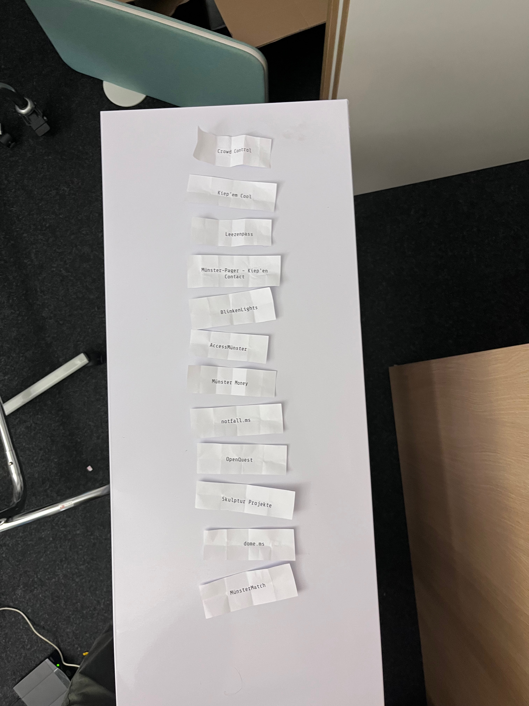

# Münsterhack 2026

- Nachgeha(c)kt Preis 2026: **Stolperstimme**

# Die Projekte

## AccessMünster

- Barrierefreie Routenplanung für Münster: rollstuhlgerechte, schattige Wege ohne Hitze/Hindernisse. Künftig mit Nutzerverwaltung & weiteren Barrierefreiheits-Angeboten.
- **Team:** Anuschka, Farah, Joel, Judith, Karin, Lena, Mahboubeh, Markus, Paula, Peter, Stefan
- **Code:** [xxxx](xxxx)
- **Ergebnis:** [xxx](xxx)

## BlinkenLights

- Der Gamefloor bringt mehr Spaß nach Münster! Durch interaktive Stadtkunstwerke sollen Menschen auf spielerische Art zusammengebracht werden.
- **Team:** Alexander, Frederik, Hendrik, Jonas, Joshua, Kilian, Marie-Christine, Martin, Matteo, Naemi, Pascal
- **Code:** [MSHack2026-BlinkenLights](https://github.com/MSHack2026-BlinkenLights)
- **Ergebnis:** [xxx](xxx)

## Crowd Control

- Wir visualisieren Besuchermengen auf größeren Events, z.b. Messen oder Volksfeste.
- **Team:** Emily, Sarah, Tim, Tino
- **Code:** [xxxx](xxxx)
- **Ergebnis:** [xxx](xxx)

## dome.ms

- dome.ms, die IT-Abteilung, die Münster gehört: eine Web Application Firewall, die Websites von Vereinen und Firmen schützt, betrieben von Partnern vor Ort und getragen als Genossenschaft.
- **Team:** Birkan, Felix, Felix, Florian, Moritz, Paul, Sophia
- **Code:** [dome-ms](https://github.com/Just-another-Muensterhack/dome-ms), [dome-ms-infra](https://github.com/Just-another-Muensterhack/dome-ms-infra)
- **Ergebnis:** [https://dome.ms](https://dome.ms)
- **Platzierung:** 3. Platz, MentorInnenpreis

## Kiep'em Cool

- Kiep'em Cool gibt bei starker Hitze einfach persönliche Empfehlungen: Aus Münsters offenen Daten, Standort und Live-Wetter erfahren vor allem vulnerable Menschen, was ihnen jetzt hilft.
- **Team:** Anusan, Björn, Cuma, Hendrik, Jana, Jonas, Max, Nic, Steffen
- **Code:** [xxxx](xxxx)
- **Ergebnis:** [xxx](xxx)

## Leezenpass

- A digital bike pass for Münster that makes stolen bikes hard to sell: register your bike in 60 seconds with a photo (AI detects type, colours, brand and frame number), check a frame number before buying a used bike, prove ownership with your receipt and a one-time code, and report thefts. Goodwill points reward confirmed help from the community and strengthen solidarity among cyclists.
- **Team:** Adarsh, Frank, Niharika, Philipp, Viola
- **Code:** [MunsterHack-LeezenPass](https://github.com/iamAdarshh/MunsterHack-LeezenPass)

## Münster Money

- Münster hat einen Plan. Wir machen ihn lesbar: Münster Money verwandelt den Haushalt 2026/27 in interaktive Diagramme. Entdecke, wohin das Geld fließt – ganz ohne Kämmerei-Diplom.
- **Team:** Annabell, Christian, Elina, Johann, Robin, Thomas, Thomas, Tobias
- **Code:** [Repo](https://github.com/codeformuenster/haushalt-muenster-2026)
- **Ergebnis:** [Online](https://codeformuenster.org/haushalt-muenster-2026)
- **Platzierung:** 1. Platz

## Münster-Pager - Kiep'en Contact

- Münsterpager ist dein persönlicher Kiepenkerl: Er hält Familien, Nachbarn und Gruppen in Münster erreichbar, ganz ohne Handynetz, und zeigt per GPS, wo jemand ist, wenn es darauf ankommt.
- **Team:** Luke, Marc, Rebekka, Thorben, Vadim
- **Code:** [xxxx](xxxx)
- **Ergebnis:** [xxx](xxx)
- **Platzierung:** 2. Platz

## MünsterMatch

- Zeit ist wertvoll und Recherche nach Aktivitäten kostet viel Zeit und man entdeckt viele tolle Aktivitäten potentiell nicht. Unser USP ist, dass wir dem Nutzer auf Basis von Präferenzen Aktivitäten mi
- **Team:** Damian-Luke, Ina, Jonas, Jonathan, Martin, Maximilian, Timo
- **Code:** [Repo](https://github.com/timogriese/aktivitaeten_in_muenster/)
- **Ergebnis:** [xxx](xxx)

## notfall.ms

- notfall.ms bietet Münsteraner offlinefähige Lösungen, um im Krisenfall wichtige Informationen verfügbar zu halten und auch bei Ausfällen weiterhin miteinander kommunizieren zu können.
- **Team:** David, Eike, Georg, Robert
- **Code:** [notfall-ms](https://github.com/notfall-ms)
- **Ergebnis:** [https://notfall.ms](https://notfall.ms)

## OpenQuest

- Münster wird zum Spielfeld! Entdecke Bäume, sammle Punkte und erobere Stadtteile. Je mehr Bäume du findest, desto größer deine Chance. Open Data wird dabei spielerisch erweitert und aktualisiert.
- **Team:** Alicia Kristina, Lara, Lea, Leon, Leon, Roman, Selina, Simon
- **Code:** [OpenQuest](https://github.com/RomanHerbstmann/OpenQuest)
- **Ergebnis:** [https://openquest.fun](https://openquest.fun), [https://karte.openquest.fun/](https://karte.openquest.fun/)

## Skulptur Projekte

- Einen Chatbot für die Skulptur Projekte Münster 2027, der verlässliche und geprüfte Antworten liefert und der KI-Halluzinationen verhindert.
- **Team:** Ardelia, Ina, Jessica, Lukas, Ruwen, Sara, Stacie, Verena
- **Code:** [xxxx](xxxx)
- **Ergebnis:** [xxx](xxx)

# Honorable Mentions (außerhalb der Wertung, coole Projekte)

- [MS Hack Plaza](https://ts.thunfischtoast-home.de/) [Source](https://github.com/thunfischtoast/muensterhack_mmo) - Das MMO für den Münsterhack.
- [jovel.app](https://jovel.app) [Source](https://github.com/willi84/jovel.app) - Die Übersichtsapp für den Münsterhack

# Pitchreihenfolge:

